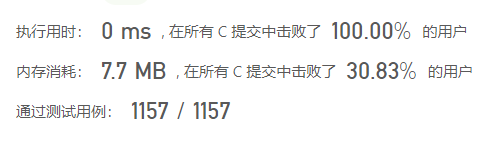
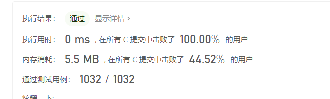
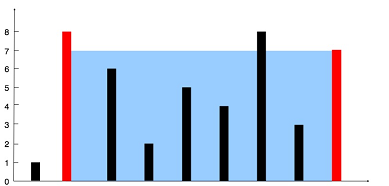

## Leetcode Record

### Section 1

> 2022.03.08

#### 1. Two Sum

Given an array of integers `nums` and an integer `target`, return indices of the two numbers such that they add up to `target`.

You may assume that each input would have **exactly one solution**, and you may not use the same element twice.

You can return the answer in any order.

##### Example 1：

```elm
Input：nums = [2,7,11,15], target = 9
Output：[0,1]
Explanation：因为 nums[0] + nums[1] == 9 ，返回 [0, 1] 。
```

##### Example 2：

```elm
Input：nums = [3,2,4], target = 6
Output：[1,2]
```

##### Example 3：

```elm
Input：nums = [3,3], target = 6
Output：[0,1]
```

##### Constraints：

- $2 <= nums.length <= 104$
- $-109 <= nums[i] <= 109$
- $-109 <= target <= 109$
- **Only one valid answer exists.**

##### Solution [code](./source/1.c)

```c
int* twoSum(int* nums, int numsSize, int target, int* returnSize){
    if (numsSize==0)return NULL;
    for(int i=0;i<numsSize-1;i++){
        if(nums[numsSize-1]+nums[i]==target){
            int *result=(int*)malloc(sizeof(int)*2);
            result[0]=i;
            result[1]=numsSize-1;
            *returnSize=2;
            return result;
        }
    }
    return twoSum(nums,numsSize-1,target,returnSize);
}
```

##### Note:

这种方式复杂度是$O(N^2)$，每次找到最后一个数字，判断前面每个数字与其相加是否符合，如果全部不符合，则标记的数组长度简短，逻辑上删除最后一个元素。

想要得到更优的复杂度，可以采取这样的方式：

1. table_sort，对其进行大小排序的同时不打乱位置，在排序过程中采取quick_sort可以达到平均复杂度$O(NlgN)$；
2. 排序后，分别从两头向中间逼近，如果两个和大于目标，则达头的指针内移，小于目标则小头指针内移；在遇到找到目标位置或者两个指针相遇后，离开循环，复杂度$O(N)$;
3. 因此总的复杂度为$O(NlgN)$.
4. 但是空间复杂度明显增加

#### 2. Add Two Numbers

You are given two **non-empty** linked lists representing two non-negative integers. The digits are stored in **reverse order**, and each of their nodes contains a single digit. Add the two numbers and return the sum as a linked list.

You may assume the two numbers do not contain any leading zero, except the number 0 itself.

##### Example 1:

```elm
Input: l1=[2,4,3], l2=[5,6,4]
Output: [7,0,8]
Explanation: 342+465=807
```

##### Example 2:

```elm
Input: l1=[0], l2=[0]
Output: [0]
```

##### Example 3:

```elm
Input: l1=[9,9,9,9,9,9,9], l2=[9,9,9,9]
Output: [8,9,9,9,0,0,0,1]
```

##### Solution [code](./source/2.c)

```c
struct ListNode* addTwoNumbers(struct ListNode* l1, struct ListNode* l2){
    int increase=0;
    struct ListNode *l3;
    struct ListNode *p3=l3;
    struct ListNode *p1=l1;
    struct ListNode *p2=l2;
    while(p1&&p2){
        struct ListNode *new;
        new=(struct ListNode*)malloc(sizeof(struct ListNode));
        new->val=p1->val+p2->val+increase;
        increase=0;
        while(new->val>9){
            new->val-=10;
            increase+=1;
        }
        new->next=NULL;
        if(p3)p3->next=new;
        else l3=new;
        p3=new;
        p2=p2->next;
        p1=p1->next;
    }
    while(p1){
        struct ListNode *new;
        new=(struct ListNode*)malloc(sizeof(struct ListNode));
        new->val=p1->val+increase;
        increase=0;
        while(new->val>9){
            new->val-=10;
            increase+=1;
        }
        new->next=NULL;
        if(p3)p3->next=new;
        else l3=new;
        p3=new;
        p1=p1->next;
    }
    while(p2){
        struct ListNode *new;
        new=(struct ListNode*)malloc(sizeof(struct ListNode));
        new->val=p2->val+increase;
        increase=0;
        while(new->val>9){
            new->val-=10;
            increase+=1;
        }
        new->next=NULL;
        if(p3)p3->next=new;
        else l3=new;
        p3=new;
        p2=p2->next;
    }
    if(increase){
        struct ListNode *new;
        new=(struct ListNode*)malloc(sizeof(struct ListNode));
        new->val=increase;
        increase=0;
        new->next=NULL;
        if(p3)p3->next=new;
        else l3=new;
        p3=new;
    }
    return l3;    
}
```

##### Note:

1. 这是相当于对两个链表进行一次遍历，因此复杂度为$O(M+N)$;
2. 需要注意的是进位可能从两个链表皆有余的情况进位给仅剩单个链表的情况，进而进位给原来没有的数位。


#### 3. Longest Substring Without Repeating Characters

Given a string `s`, find the length of the **longest substring** without repeating characters.

##### Example 1

```elm
Input: s = "abcabcbb"
Output: 3
Explanation: The answer is "abc", with the length of 3.
```

##### Example 2

```elm
Input: s = "bbbbb"
Output: 1
Explanation: The answer is "b", with the length of 1.
```

##### Example 3

```elm
Input: s = "pwwkew"
Output: 3
Explanation: The answer is "wke", with the length of 3.
Notice that the answer must be a substring, "pwke" is a subsequence and not a substring.
```

##### Constraints

- $0 <= s.length <= 5*10^4$
- `s` consists of English letters, digits, symbols and spaces

##### Solution [code](./source/3.c)

```c
int find(char x,char *s,int start,int end){
    int ret=-1;
    for(int i=start;i<=end;i++){
        if(x==s[i]){
            ret=i;
            break;
        }
    }
    return ret;
}
int lengthOfLongestSubstring(char * s){
    int length=0;
    int temp=0;
    int a=0,b=0;
    while(b<strlen(s)){
        b++;
        if(find(s[b],s,a,b-1)==-1){
            temp=b-a;
            length=(temp>length)?temp:length;
        }
        else{
            temp=b-a;
            a=1+find(s[b],s,a,b-1);
            length=(temp>length)?temp:length;
        }
    }
    return length;
}
```

##### Note:

1. 从前往后依次读入一个字符，判断标定的字符串内是否存在该字符；
2. 不存在则当前长度增加，与记录的最长长度比较，更新最长长度；
3. 存在则移动标定字符串的头，直到不存在重复，更新当前长度和最长长度；
4. 标定字符串尾到达总字符串尾部，结束；
5. 每读入一个字符都要对前面进行搜索，故时间复杂度为$O(N^2)$

> 2022.03.09

#### 4. Median of Two Sorted Arrays

Given two sorted arrays `nums1` and `nums2` of size `m` and `n` respectively, return **the median** of the two sorted arrays.

The overall run time complexity should be `O(log (m+n))`.

##### Example 1

```elm
Input: nums1 = [1,3], nums2 = [2]
Output: 2.00000
Explanation: merged array = [1,2,3] and median is 2.
```

##### Example 2

```elm
Input: nums1 = [1,2], nums2 = [3,4]
Output: 2.50000
Explanation: merged array = [1,2,3,4] and median is (2 + 3) / 2 = 2.5.
```

##### Constraints

- $nums1.legnth == m$
- $nums2.legnth == n$
- $0 <= m <=1000$
- $0 <= n <= 1000$
- $1 <= m+n <= 2000$
- $-10^6 <= nums1[i], nums2[i] <= 10^6$

##### Solution [code](./source/4.c)

```c
double findMedianSortedArrays(int* nums1, int nums1Size, int* nums2, int nums2Size){
    int sum=nums2Size+nums1Size;
    int nums3[MAX+MAX]={0};
    int re=sum%2;
    int index=0;
    int a1=0,a2=0;
    while(a1<nums1Size&&a2<nums2Size){
        if(nums1[a1]<nums2[a2])nums3[index++]=nums1[a1++];
        else(nums1[a1]>nums2[a2])nums3[index++]=nums2[a2++];
    }
    while(a1<nums1Size)nums3[index++]=nums1[a1++];
    while(a2<nums2Size)nums3[index++]=nums2[a2++];
    if(re){
        index=(sum-re)/2;
        return (double)nums3[index];
    }
    else{
        index=sum/2;
        return ((double)nums3[index]+(double)nums3[index-1])/2.0;
    }
}
```

##### Note:

1. 这题需要寻找中位数，要求的时间复杂度为$O(log(M+N)$，相当于将两个给定的数组遍历一遍；
2. 可以真正生成一个新数组，是两个数组的归并，像上面代码示例，也可以标记的形式，获取对应数字即可，在源代码中有；
3. 只需要针对大小进行指针的前进选择，到达对应位置即可找到；
4. 需要分奇数偶数进行输出；
5. 输出结果是五位小数的`double`。

> 2022.03.10

#### 5. Longest Palindromic Substring

Given a string `s`, return *the longest palindromic substring* in `s`.

##### Example 1

```elm
Input: s = "babad"
Output: "bab"
Explanation: "aba" is also a valid answer.
```

##### Example 2

```elm
Input: s = "cbbd"
Output: "bb"
```

##### Constraints

- $1<=s.length<=1000$
- `s` consist of only digits and English letters.

##### Solution [code](./source/5.c)

```c
char * longestPalindrome(char * s){
    int a1=0,a2=0;
    int length=1;
    int len=strlen(s);
    int start=0,end=len-1;
    int flag=1;
    while(start<len-length){
        while(end-start+1>length){
            for(int i=0;i<=(end-start)/2;i++){
                if(s[start+i]!=s[end-i]){
                    flag=0;
                    break;
                }
            }
            if(flag){
                a1=start;
                a2=end;
                length=end-start+1;
                break;
            }
            end--;
            flag=1;
        }
        end=len-1;
        start++;
        flag=1;
    }
    char *ret=(char*)malloc(sizeof(char)*(length+1));
    for(int i=a1;i<=a2;i++)ret[i-a1]=s[i];
    ret[length]='\0';
    return ret;
}
```

##### Note:

1. 这里采用的是每次改变头尾位置，判断串长度是否大于已知自反串的长度，如果更短，则剪枝；
2. 如果更长，则判断是否自反，上面示例是采取首位比较的方式，比较到中间位置即可；
3. 对于自反串，则记录新的长度和首尾位置
4. 循环结束后，申请内存空间，将首位位置之间的串拷贝到新空间，返回地址；
5. 这三点节省了搜索次数：
   1. 在原字符串未检测长度小于已知自反串长度时就可以结束；
   2. 在检测的串已经出现了自反串后，该串的检测可以结束；
   3. 在检测串长度小于已知自反串长度后，该串可以结束检测；

> 2022.03.11
>
> >2022.03.12补

#### 6. ZigZag Conversion

The string `"PAYPALISHIRING"` is written in a zigzag pattern on a given number of rows like this: (you may want to display this pattern in a fixed font for better legibility)

```
P   A   H   N
A P L S I I G
Y   I   R
```

And then read line by line: `"PAHNAPLSIIGYIR"`

Write the code that will take a string and make this conversion given a number of rows:

```c
string convert(string s, int numRows);
```

##### Example 1

```elm
Input: s = "PAYPALISHIRING", numRows = 3
Output: "PAHNAPLSIIGYIR"
```

##### Example 2

```elm
Input: s = "PAYPALISHIRING", numRows = 4
Output: "PINALSIGYAHRPI"
Explanation:
P     I    N
A   L S  I G
Y A   H R
P     I
```

##### Example 3

```elm
Input: s = "A", numRows = 1
Output: "A"
```

##### Constraints

- $1 <= s.length <= 1000$
- `s` consists of English letters (lower-case and upper-case), `','` and `'.'`
- $1 <= numRows <= 1000$

##### Solution [code](./source/6.c)

```c
char * convert(char * s, int numRows){
    if(numRows==1)return s;
    int step=(numRows-1)*2;
    char *ret=(char*)malloc(sizeof(char)*1001);
    memset(ret,0,1001);
    int i=0,j=0,start=0,nap=step;
    for(start=0;start<=step/2;start++){
        nap=step-start;
        for(i=start;i<strlen(s);i+=step){
            ret[j++]=s[i];
            if(nap<step&&nap>step/2&&i+nap-start<strlen(s))ret[j++]=s[i+nap-start];
        }
    }
    ret[j]='\0';
    return ret;
}
```

##### Note:

1. 对于每个行数，都有对应的周期；
2. 每个周期内，第一行和最后一行都只有一个元素；中间各行都有两个元素；
3. 于是根据行数计算出间隔，每次拷贝一个元素，最后进行返回；



>2022.03.12[植树节]

#### 7. Reverse Integer

Given a signed 32-bit integer `x`, return `x` with its digits reversed. If reversing `x` causes the value to go outside the signed 32-bit integer range $[-2^{31}, 2^{31} - 1]$, then return `0`.

**Assume the environment does not allow you to store 64-bit integers (signed or unsigned).**

##### Example 1

```elm
Input: x = 123
Output: 321
```

##### Example 2

```elm
Input: x = -123
Output: -321
```

##### Example 2

```elm
Input: x = 120
Output: 21
```

##### Constraints

- $-2^{31}<=x<= 2^{31} - 1$

##### Solution [code](./source/7.c)

```c
int reverse(int x){
    int flag=1;
    if(x<0)flag=-1;
    int ret=0;
    while (x!=0)
    {
        if(ret<=214748364&&ret>=-214748364)ret=flag*(x%10)+ret*10;
        else return 0;
        x=x/10;
    }
    return flag*ret;
}
```

##### Note:

1. 采取的方法是取模加到返回值末尾；
2. 需要注意的是原先的数字倒过来之后可能就不在范围内了，因此返回值`*10`之前需要先判断大小；
3. 倒序后不在范围内的值直接返回`0`即可。




#### 8. String to Integer (atoi)

Implement the `myAtoi(string s)` function, which converts a string to a 32-bit signed integer (similar to C/C++'s `atoi` function).

The algorithm for `myAtoi(string s)` is as follows:

1. Read in and ignore any leading whitespace.
2. Check if the next character (if not already at the end of the string) is `'-'` or `'+'`. Read this character in if it is either. This determines if the final result is negative or positive respectively. Assume the result is positive if neither is present.
3. Read in next the characters until the next non-digit character or the end of the input is reached. The rest of the string is ignored.
4. Convert these digits into an integer (i.e. `"123" -> 123`, `"0032" -> 32`). If no digits were read, then the integer is `0`. Change the sign as necessary (from step 2).
5. If the integer is out of the 32-bit signed integer range `[-2^31, 2^31 - 1]`, then clamp the integer so that it remains in the range. Specifically, integers less than `-2^31` should be clamped to `-2^31`, and integers greater than `2^31 - 1` should be clamped to `2^31 - 1`.
6. Return the integer as the final result.

**Note:**

- Only the space character `' '` is considered a whitespace character.
- **Do not ignore** any characters other than the leading whitespace or the rest of the string after the digits.

##### Example 1

```elm
Input: s = "42"
Output: 42
Explanation: The underlined characters are what is read in, the caret is the current reader position.
Step 1: "42" (no characters read because there is no leading whitespace)
         ^
Step 2: "42" (no characters read because there is neither a '-' nor '+')
         ^
Step 3: "42" ("42" is read in)
           ^
The parsed integer is 42.
Since 42 is in the range [-231, 231 - 1], the final result is 42.
```

##### Example 2

```elm
Input: s = "   -42"
Output: -42
Explanation:
Step 1: "   -42" (leading whitespace is read and ignored)
            ^
Step 2: "   -42" ('-' is read, so the result should be negative)
             ^
Step 3: "   -42" ("42" is read in)
               ^
The parsed integer is -42.
Since -42 is in the range [-231, 231 - 1], the final result is -42.
```

##### Example 3

```elm
Input: s = "4193 with words"
Output: 4193
Explanation:
Step 1: "4193 with words" (no characters read because there is no leading whitespace)
         ^
Step 2: "4193 with words" (no characters read because there is neither a '-' nor '+')
         ^
Step 3: "4193 with words" ("4193" is read in; reading stops because the next character is a non-digit)
             ^
The parsed integer is 4193.
Since 4193 is in the range [-231, 231 - 1], the final result is 4193.
```

 

##### Constraints

- `0 <= s.length <= 200`
- `s` consists of English letters (lower-case and upper-case), digits (`0-9`), `' '`, `'+'`, `'-'`, and `'.'`.

##### Solution [code](./source/8.c)

```c
#define up 2147483647
#define bottom -2147483648
#define MAX 201
int myAtoi(char * s){
    int ret=0;
    int flag=1;
    int index=0;
    int cnt=0;
    while(s[index]&&s[index]==' ')index++;
    if(s[index]=='+'){
        index++;
        cnt++;
    }
    else if(s[index]=='-'){
        index++;
        flag=-1;
        cnt++;
    }
    if(cnt>1)return 0;
    if(flag>0){
        while(s[index]>='0'&&s[index]<='9'){
            if(ret<up/10)ret=ret*10+(s[index++]-'0');
            else if(ret==up/10){
                if(s[index]<='7')ret=ret*10+(s[index++]-'0');
                else return up;
            }
            else return up;
        }
    }
    else{
        while(s[index]>='0'&&s[index]<='9'){
            if(ret>bottom/10)ret=ret*10-(s[index++]-'0');
            else if(ret==bottom/10){
                if(s[index]<='8')ret=ret*10-(s[index++]-'0');
                else return bottom;
            }
            else return bottom;
        }
    }
    return ret;
}
```

##### Note:

1. 借助一个**int**型标记当前位置；
2. 首先通过循环去掉开头的空格；
3. 然后判断是否存在符号，记录符号数目以及最后一个符号的类型，如果：
   1. 多个符号，返回**0**
   2. 单个或者一个，继续读取数字；
4. 根据符号判断正负，分别进行计算：
5. 每次读取一个数字，将已有数字与上下界的十分之一比较：
   1. 小于其十分之一，将原数字***10**后加上新读入数字
   2. 等于十分之一，查看新数字与其尾数大小关系：
      1. 小于其尾数，如5.1
      2. 否则根据正负返回上界或者下界
   3. 大于十分之一，如5.2.2
6. 如果读到的不是数字，则退出循环，返回得到的数字

> 2022.03.13

#### 9. Palindrome Number

Given an integer `x`, return `true` if `x` is palindrome integer.

An integer is a **palindrome** when it reads the same backward as forward.

- For example, `121` is a palindrome while `123` is not.

 ##### Example 1

```elm
Input: x = 121
Output: true
Explanation: 121 reads as 121 from left to right and from right to left.
```

##### Example 2

```elm
Input: x = -121
Output: false
Explanation: From left to right, it reads -121. From right to left, it becomes 121-. Therefore it is not a palindrome.
```

##### Example 3

```elm
Input: x = 10
Output: false
Explanation: Reads 01 from right to left. Therefore it is not a palindrome.
```

##### Constraints

- $-2^{31} <= x <= 2^{31} - 1$

##### Solution [code](./source/9.c)

```c
bool isPalindrome(int x){
    if(x<0)return false;
    int y=0;
    while(y<x){
        y=y*10+x%10;
        x=x/10;
        if(y==0)return false;
    }
    if(x==y||y/10==x)return true;
    else return false;
}
```

##### Note:

1. 负数不属于回文，直接返回否定
2. 我们定义一个初始化为0的变量，用于计算输入值的回文值，但是考虑到部分值会超出int的值，所以我们只计算后一半的倒序，与前一半进行比较；
3. 以0结尾的值不可能为回文，且会影响计算，因此，第一次计算之后如果记录值为0，则返回否定；
4. 当剩余长度不大于记录长度时，进行比较，根据长度的奇偶可能会使来着相等，或者记录长一位，据此返回。

> 2022.03.14

#### 10. Regular Expression Matching

Given an input string `s` and a pattern `p`, implement regular expression matching with support for `'.'` and `'*'` where:

- `'.'` Matches any single character.
- `'*'` Matches zero or more of the preceding element.

The matching should cover the **entire** input string (not partial).

#####  Example 1

```elm
Input: s = "aa", p = "a"
Output: false
Explanation: "a" does not match the entire string "aa".
```

##### Example 2

```elm
Input: s = "aa", p = "a*"
Output: true
Explanation: '*' means zero or more of the preceding element, 'a'. Therefore, by repeating 'a' once, it becomes "aa".
```

##### Example 3

```elm
Input: s = "ab", p = ".*"
Output: true
Explanation: ".*" means "zero or more (*) of any character (.)".
```

#####  Constraints

- `1 <= s.length <= 20`
- `1 <= p.length <= 30`
- `s` contains only lowercase English letters.
- `p` contains only lowercase English letters, `'.'`, and `'*'`.
- It is guaranteed for each appearance of the character `'*'`, there will be a previous valid character to match.

##### Solution [code](./source/10.c)

```c
int expindex(char *s,char c){
    int i=0;
    while(s[i]!='\0'){
        if(s[i]!=c)return i;
        i++;
    }
    return -1;
}
bool isMatch(char * s, char * p){
    // printf("%s\n%s\n\n",s,p);
    if(p[0]=='\0'&&s[0]=='\0')return true;
    if(p[0]=='\0'&&s[0]!='\0')return false;
    if(p[0]!='\0'&&s[0]=='\0'){
        if(p[1]=='*')return isMatch(&s[0],&p[2]);
        else return false;
    }
    if(p[1]!='*'&&p[0]!='.'){
        if(s[0]==p[0])return isMatch(&s[1],&p[1]);
        else return false;
    }
    else if(p[1]=='*'&&p[0]!='.'){
        if(s[0]!=p[0])return isMatch(&s[0],&p[2]);
        if(p[2]==p[0]){
            if(s[0]!=p[0])return false;
            if(p[3]!='*'){
                p[1]=p[0];
                p[2]='*';            
                return isMatch(&s[1],&p[1]);
            }
            else{
                return isMatch(&s[1],&p[2]);
            }
        }
        else{
            if(p[2]=='\0'){
                int idx=expindex(&s[0],p[0]);
                if(idx==-1)return true;
                else return isMatch(&s[idx],&p[2]);
            }
            else if(p[3]!='*'){
                int idx=expindex(&s[0],p[0]);
                if(idx==-1)return false;
                else{
                    bool ret=isMatch(&s[idx],&p[2]);
                    for(int temp=0;temp<idx;temp++){
                        ret=ret|isMatch(&s[temp],&p[2]);
                    }
                    return ret;
                }
            }
            else{
                int idx=expindex(&s[0],p[0]);
                if(idx==-1){
                    p[2]=p[0];
                    return isMatch(&s[0],&p[2]);
                }
                else{
                    bool ret=isMatch(&s[idx],&p[2]);
                    for(int temp=0;temp<idx;temp++){
                        ret=ret|isMatch(&s[temp],&p[2]);
                    }
                    return ret;
                }
            }
        }
    }
    else if(p[1]=='*'&&p[0]=='.'){
        bool ret=false;
        if(p[2]=='\0')return true;
        else if(p[2]=='.'){
            if(p[3]!='*'){
                p[1]=p[0];
                p[2]='*';
                return isMatch(&s[1],&p[1]);
            }
            else return isMatch(&s[1],&p[2]);
        }
        else{
            if(p[3]=='*'){
                p[2]='.';
                return isMatch(&s[0],&p[2]);
            }
            int j=0;
            int flag=1;
            while(s[j]!='\0'){
                if(s[j]==p[2]){
                    ret=ret|isMatch(&s[j],&p[2]);
                    flag*=0;
                }
                j++;
            }
            return (1-flag)*ret;
        }
    }
    else{//p[1]!='*'&&p[0]=='.'
        return isMatch(&s[1],&p[1]);
    }
}
```

##### Note:

1. 不愧是困难题目
2. 采取递归的方式逐步前进
3. 首先查看是否是空字符串
   1. 都空，匹配成功；
   2. 字符串不空，正则空，匹配失败；
   3. 字符串空，正则不空，查看是否是带有`*`，消去一个`*`然后递归查看。
4. 查看第一个和第二个正则字符：
   1. 如果第一个不是`.`，第二个不是`*` :5
   2. 如果第一个不是`.`，第二个是`*` ：6
   3. 如果第一个是`.`，第二个是`*` ：7
   4. 如果第一个是`.`，第二个不是`*` ：8
5. 如果字符串第一个相同，则对第二个字符开始部分进行查看，否则不匹配；
6. 先考察开头是否相同，对于不同的，则消去正则开头的一组`*`，然后递归调用匹配函数；如果相同，则考察正则式第一个`*`前后是否相同：如果相同，查看第一组`*`后面是否跟着一组`*` ，是的话则消去第一组，没有的话则将第一组`*`后移一个字符，同时删去字符串的首个字符，递归调用；如果`*`前后不同：
   1. 如果仅有一组`*` ，那么根据字符串中有无与首部不同的字符直接返回对应值；
   2. 如果存在第二组值，且第二组不为`*`，那么在字符串中查找该字符第一次出现的位置idx，将消掉第一组0，1，2，...，idx-1个的字符串匹配结果或起来，进行返回；
   3. 此外则是第二组也是`*`，则先从字符串找到第一个与正则式第一个不同的位置idx，和6.2相同做法，或起来作为返回值，如果全部相同，那么后移第一组`*`占据第二组的位置，递归调用。
7. 如果仅有上述那么多，则匹配成功；否则，考察第三个是否为`.`，如果是，则考察第四个是否为`*`，如果也是，则移去第一组，递归调用，如果不是，则字符串消去第一个值，正则式第一组`*`覆盖第二组的单个`.`；如果第二组不是`.`开头，考察第四位，若为`*`则用第一组的万能匹配覆盖第二组的特定闭包，递归调用；若不是，则找到字符串中每个包含正则式第三位值的位置，对所有可能性取或进行返回，如果一个也没有，则匹配失败。
8. 各前进一位，递归调用。

> 2022.03.15

#### 11. Container With Most Water反馈

You are given an integer array `height` of length `n`. There are `n` vertical lines drawn such that the two endpoints of the `ith` line are `(i, 0)` and `(i, height[i])`.

Find two lines that together with the x-axis form a container, such that the container contains the most water.

Return *the maximum amount of water a container can store*.

**Notice** that you may not slant the container.

##### Example 1



```elm
Input: height = [1,8,6,2,5,4,8,3,7]
Output: 49
Explanation: The above vertical lines are represented by array [1,8,6,2,5,4,8,3,7]. In this case, the max area of water (blue section) the container can contain is 49.
```

##### Example 2

```elm
Input: height = [1,1]
Output: 1
```

##### Constraints

- `n == height.length`
- $2 <= n <= 10^5$
- $0 <= height[i] <= 10^4$

##### Solution [code](./source/11.c)

```c
int maxArea(int* height, int heightSize){
    if(heightSize<2)return 0;
    int h=(height[0]<height[heightSize-1])?height[0]:height[heightSize-1];
    int area=(heightSize-1)*h;
    int i=0,j=heightSize-1;
    if(height[0]<height[heightSize-1])
        while(height[i]<=height[0]&&i<heightSize)i++;
    else
        while(height[j]<=height[heightSize-1]&&j>0)j--;
    int area2=maxArea(&height[i],j-i+1);
    return (area2>area)?area2:area;
}
```

##### Note:

1. 这题容易时间超出限制；
2. 开始采用的是遍历计算所有面积的方式，很快就超时了；
3. 后来思考了一下，计算部分关键的面积就好了：
   1. 先计算首位围成的面积；
   2. 选择较小的一侧，向内找到比其大的第一个值，计算该位置和另一侧围成的面积；
   3. 选择较大的存下来；
4. 写了递归和迭代两种方法.

> 2022.03.16

#### 12. Integer to Roman

Roman numerals are represented by seven different symbols: `I`, `V`, `X`, `L`, `C`, `D` and `M`.

```elm
Symbol       Value
I             1
V             5
X             10
L             50
C             100
D             500
M             1000
```

For example, `2` is written as `II` in Roman numeral, just two one's added together. `12` is written as `XII`, which is simply `X + II`. The number `27` is written as `XXVII`, which is `XX + V + II`.

Roman numerals are usually written largest to smallest from left to right. However, the numeral for four is not `IIII`. Instead, the number four is written as `IV`. Because the one is before the five we subtract it making four. The same principle applies to the number nine, which is written as `IX`. There are six instances where subtraction is used:

- `I` can be placed before `V` (5) and `X` (10) to make 4 and 9. 
- `X` can be placed before `L` (50) and `C` (100) to make 40 and 90. 
- `C` can be placed before `D` (500) and `M` (1000) to make 400 and 900.

Given an integer, convert it to a roman numeral.

##### Example 1

```elm
Input: num = 3
Output: "III"
Explanation: 3 is represented as 3 ones.
```

##### Example 2

```elm
Input: num = 58
Output: "LVIII"
Explanation: L = 50, V = 5, III = 3.
```

##### Example 3

```elm
Input: num = 1994
Output: "MCMXCIV"
Explanation: M = 1000, CM = 900, XC = 90 and IV = 4.
```

 ##### Constraints

- `1 <= num <= 3999`

##### Solution [code](./source/12.c)

```c
char * intToRoman(int num){
    char *ret=(char*)malloc(sizeof(char)*16);
    memset(ret,0,16);
    int tail=0;
    int slice=0;
    if(num>=1000){
        slice=num/1000;
        while(slice-->0)ret[tail++]='M';
    }
    num=num%1000;
    if(num>=100){
        slice=num/100;
        if(slice>=5){
            if(slice==9){
                ret[tail++]='C';
                ret[tail++]='M';
                slice=0;
            }
            else{
                ret[tail++]='D';
                slice-=5;
            }
        }
        if(slice==4){
            ret[tail++]='C';
            ret[tail++]='D';
            slice=0;
        }
        else{
            while(slice-->0)ret[tail++]='C';
        }
    }
    num=num%100;
    if(num>=10){
        slice=num/10;
        if(slice>=5){
            if(slice==9){
                ret[tail++]='X';
                ret[tail++]='C';
                slice=0;
            }
            else{
                ret[tail++]='L';
                slice-=5;
            }
        }
        if(slice==4){
            ret[tail++]='X';
            ret[tail++]='L';
            slice=0;
        }
        else{
            while(slice-->0)ret[tail++]='X';
        }
    }
    num=num%10;
    if(num>=1){
        slice=num;
        if(slice>=5){
            if(slice==9){
                ret[tail++]='I';
                ret[tail++]='X';
                slice=0;
            }
            else{
                ret[tail++]='V';
                slice-=5;
            }
        }
        if(slice==4){
            ret[tail++]='I';
            ret[tail++]='V';
            slice=0;
        }
        else{
            while(slice-->0)ret[tail++]='I';
        }
    }
    return ret;
}
```

##### Note:

1. 只需要分数位判断；
2. 对不同数位先判断是否为9，然后判断是否大于等于5，接着判断是否为4；
3. 每次在字符串结尾加上就好了

> 2022.03.16
